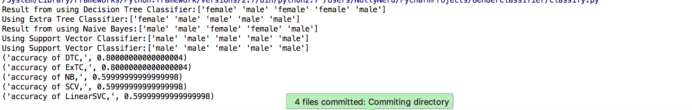

# GenderClassifier

This Project Classifies a users gender based on three parameters:

### Height
### Weight
### Shoe Size

Using Scikit-Learn I was able to determine the accuracy of prediction by comparing different Classifiers mentioned below:

### Naive Bayes
### Decision Tree Classifier
### Extra Tree Classifier
### Support Vector Classifier 
### Linear Support Vector Classifier

Result Below shows that Extra Tree Classifier was more accurate of the five tried.

Fork the project...can you optimize to >> 0.96 ?

